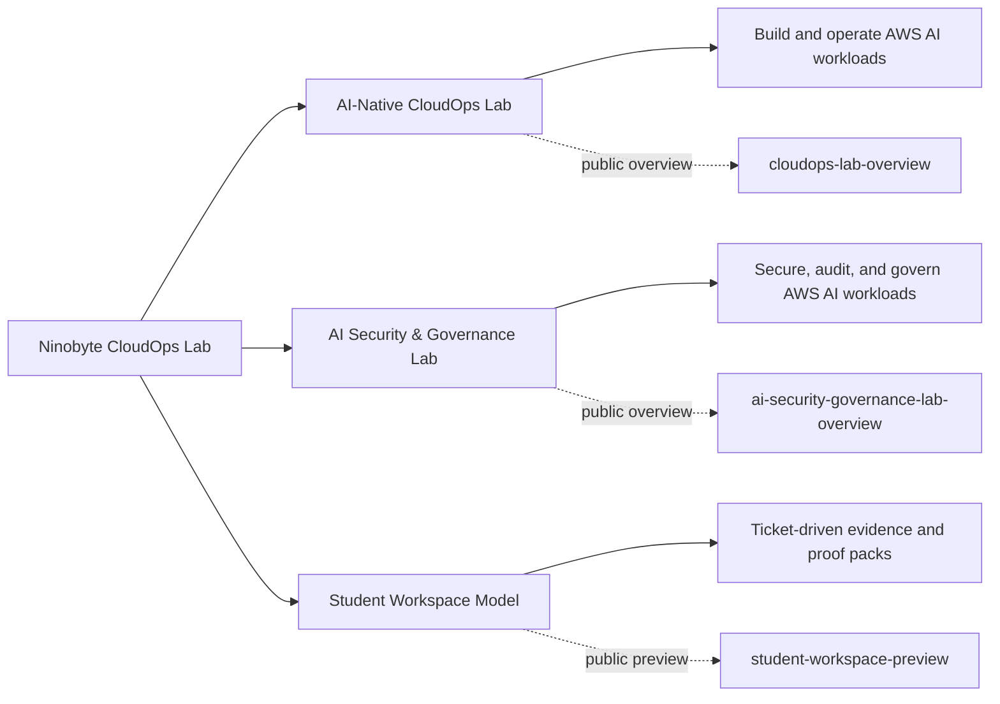

# 🧭 Ninobyte CloudOps Lab

**AWS-native training labs for AI CloudOps, security, and governance.**

Ninobyte CloudOps Lab builds governed, evidence-based training environments for professionals learning to build, operate, secure, and govern AWS AI workloads. We favor depth over breadth — AWS-native service practice, documented guardrails, and portfolio-ready proof of work, not passive courses or unverifiable certificates. We are deliberately AWS-first: this is the applied training arm of Ninobyte's AI-native direction.

> **Build. Operate. Secure. Govern AWS AI systems.**

---

## 🧪 Product lines

| Product | Focus | Audience | Status |
|---|---|---|---|
| **AI-Native CloudOps Lab** | Build, operate, and secure an AWS Bedrock workload inside a governed sandbox | Cloud builders, operators, emerging AWS/AI engineers, defensive security learners | Platform foundation; live AWS cohort readiness gated |
| **AI Security & Governance Lab — AWS Edition** | Secure, audit, investigate, and govern AWS AI workloads via evidence-based job simulation | Cloud security engineers, GRC analysts, IT auditors, security managers, AI governance pros | Docs-first foundation complete; AWS execution gated |
| **Student Workspace Model** | Ticket-driven learner workspace for AWS AI practice and proof-pack development | Enrolled learners and cohort participants | Private template beta-ready; delivery workflow pending |

---

## 📦 Public overview repositories

**Start here.** These public repositories are the best entry points for partners, students, and reviewers. The actual training and implementation repositories remain private by design.

| Repository | What it covers |
|---|---|
| [`cloudops-lab-overview`](https://github.com/ninobyte-cloudops-lab/cloudops-lab-overview) | AI-Native CloudOps Lab overview |
| [`ai-security-governance-lab-overview`](https://github.com/ninobyte-cloudops-lab/ai-security-governance-lab-overview) | AI Security & Governance Lab — AWS Edition overview |
| [`student-workspace-preview`](https://github.com/ninobyte-cloudops-lab/student-workspace-preview) | Learner workspace model preview |

---

## 🔗 Sibling organization

The applied AI systems, education data infrastructure, and product engineering work — including the Ghana Education Data OS and Teacher-to-Author Lab — lives in our sibling org [`ninobyte-labs`](https://github.com/ninobyte-labs). The two orgs share the same governance discipline; the AWS training labs live here, the data and product engineering work lives there.

---

## ⚙️ Operating principles

- **AWS-first depth** over shallow multi-cloud theory.
- **Evidence before claims** — work is shown, not asserted.
- **Governance before deployment** — guardrails precede access.
- **Safe sandboxes** over uncontrolled access.
- **Proof packs** over passive certificates.
- **No public leakage** of internal or learner materials.

---

## ✅ Status

| Area | Status |
|---|---|
| Product architecture | Established; execution readiness remains gated |
| Student workspace | Private template beta-ready; cohort workflow pending |
| AWS execution | Blocked until cost, safety, and teardown validation pass |
| Public materials | Overview-only; no internal solution or AWS details |

---

## 👥 Who this is for

Students and working professionals building verifiable AWS AI skills; security and GRC practitioners who need hands-on AWS AI governance practice; cloud engineers operating real AI workloads; and partners or reviewers evaluating governed, evidence-based training.

---

## 🔒 Private product repositories

These repositories are **private by design** — they protect curriculum, lab design, governance materials, and learner workspaces. Public visitors should use the [public overview repositories](#-public-overview-repositories) above.

| Repository | Purpose |
|---|---|
| `ninobyte-cloudops-lab-core` | Curriculum, lab architecture, sandbox governance, and launch system for the AI-Native CloudOps Lab |
| `ai-security-governance-lab-aws` | Product, curriculum, and governance foundation for the AI Security & Governance Lab — AWS Edition |
| `ai-security-governance-lab-student-template` | Sanitized, portfolio-safe learner workspace template for the Security & Governance Lab |

> 🚫 Internal solution guides, instructor answer keys, and AWS account details are never published. A future CloudOps student workspace is planned but does not yet exist.

---

## 🚫 What this organization is not

- Not a public exploit lab.
- Not a generic cybersecurity bootcamp.
- Not a job guarantee.
- Not a compliance certification.
- Not a public repository of internal solution guides.
- Not a claim of AWS partnership or official status.

---

## Contact

For partnership, cohort, team-training, or review conversations, reach Ninobyte through its official channels.
