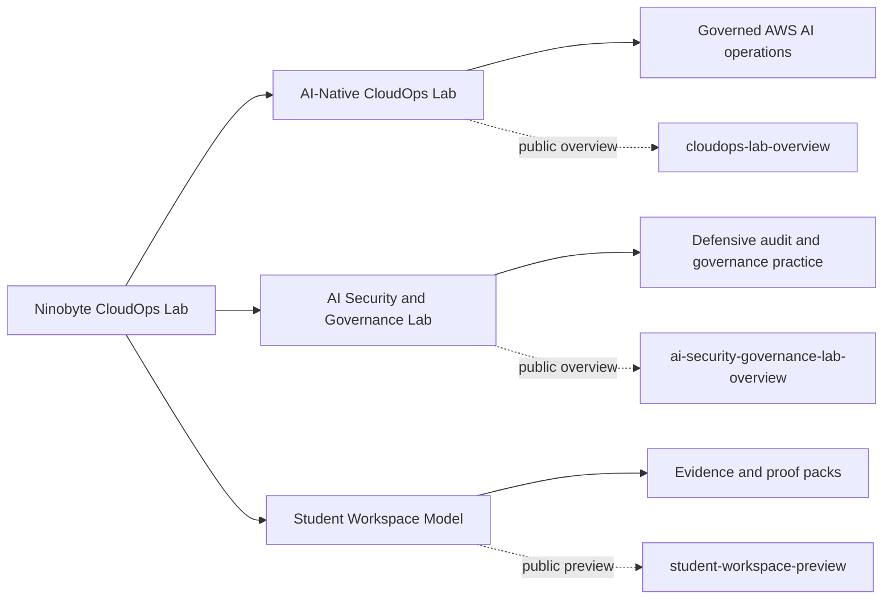

# Ninobyte CloudOps Lab

**AWS-native CloudOps and AI Security practice for governed AI work.**

Ninobyte CloudOps Lab is the AWS, CloudOps, and AI Security/Governance lab surface for Ninobyte's Connected AI Operator work. The lab is built around one practical doctrine: **Connect. Govern. Execute. Prove.**

We use public overview repositories to explain the learning model and private lab systems to protect curriculum, learner work, sandbox design, and account details. The goal is verifiable AWS AI practice: safe constraints, defensive governance, audit evidence, and proof packs.

---

## Practice areas

| Practice area | Focus | Public entry point | Status |
|---|---|---|---|
| **AI-Native CloudOps Lab** | Build and operate AWS AI workload patterns inside governed sandbox workflows. | [`cloudops-lab-overview`](https://github.com/ninobyte-cloudops-lab/cloudops-lab-overview) | Public overview released; live AWS execution remains gated. |
| **AI Security & Governance Lab** | Secure, audit, investigate, and govern AWS AI workload patterns from a defensive posture. | [`ai-security-governance-lab-overview`](https://github.com/ninobyte-cloudops-lab/ai-security-governance-lab-overview) | Public overview released; lab execution remains gated. |
| **Student Workspace Model** | Ticket-driven learner workspace for evidence capture and proof-pack development. | [`student-workspace-preview`](https://github.com/ninobyte-cloudops-lab/student-workspace-preview) | Public preview only; private template remains protected. |

## Operating doctrine

| Step | CloudOps meaning |
|---|---|
| **Connect** | Link AWS services, AI workload context, tickets, docs, and evidence into a coherent lab workflow. |
| **Govern** | Set sandbox rules, cost boundaries, access limits, defensive scope, and review gates before execution. |
| **Execute** | Perform guided build, operate, secure, and audit tasks inside constrained practice environments. |
| **Prove** | Capture artifacts: tickets, screenshots, command summaries, architecture notes, and validation reports. |

## Public overview repositories

Public visitors should start here. These repos explain the lab surfaces without publishing full curriculum, implementation answers, or account-specific details.

| Repository | What it covers |
|---|---|
| [`cloudops-lab-overview`](https://github.com/ninobyte-cloudops-lab/cloudops-lab-overview) | AI-Native CloudOps Lab positioning, workflow, boundaries, and proof model. |
| [`ai-security-governance-lab-overview`](https://github.com/ninobyte-cloudops-lab/ai-security-governance-lab-overview) | Defensive AI security, governance, audit evidence, and GRC-oriented practice model. |
| [`student-workspace-preview`](https://github.com/ninobyte-cloudops-lab/student-workspace-preview) | Portfolio-safe learner workspace structure and evidence expectations. |

## How this relates to Connected AI Operator

This org is the AWS practice lane for Connected AI Operator development. It teaches operators to work with cloud AI systems in a governed way:

- connect cloud services and task context,
- govern risk before granting access,
- execute scoped work in repeatable lab patterns,
- prove progress with artifacts that a reviewer can inspect.

The CloudOps Lab is not about collecting tools. It is about turning cloud and AI work into disciplined, reviewable practice.

## Sibling organization

Applied AI systems, education data infrastructure, product documentation, and broader proof-of-work patterns live in [`ninobyte-labs`](https://github.com/ninobyte-labs). The two orgs share the same governance discipline: public-safe documentation, private implementation boundaries, and evidence before claims.

## Public vs private boundary

| Public here | Kept private |
|---|---|
| Overview READMEs and learning model explanations | Full curriculum and instructor materials |
| High-level architecture and workflow diagrams | AWS account details and sandbox implementation specifics |
| Defensive security and governance framing | Learner workspaces and assessment materials |
| Proof-pack structure and evidence expectations | Internal solution guides and answer keys |
| Portfolio-safe examples and previews | Credentials, account access details, and unreleased lab systems |

## Operating principles

- **AWS-first depth** over shallow multi-cloud theory.
- **Defensive governance only** - no exploit lab framing.
- **Sandbox first** - lab execution stays gated until access, cost, and teardown rules are ready.
- **Evidence before claims** - work is shown through proof packs, not asserted through vague badges.
- **Public overview, private implementation** - the public surface explains the model without exposing protected training material.
- **Practical AI for real work** - the goal is disciplined cloud operation, not tool spectacle.

## Status

| Area | Status |
|---|---|
| Public overview repos | Released and aligned with the Phase 1A GitHub Facelift proof surface. |
| Lab execution | Gated until sandbox, cost, access, and teardown checks are approved. |
| Student workspace | Public preview available; private template remains protected. |
| Training materials | Private by design until delivery boundaries are approved. |

## Who this is for

- Cloud builders and operators learning AWS AI workload practice.
- Security and GRC practitioners who need defensive AI governance examples.
- Teams evaluating evidence-based AI training.
- Reviewers who want to inspect public-safe proof surfaces before a deeper conversation.

## What this organization is not

- Not a public exploit lab.
- Not a generic cybersecurity bootcamp.
- Not a job, income, or certification promise.
- Not a legal or compliance assurance.
- Not a public repository of internal solution guides.
- Not a claim of AWS partnership or official AWS status.
- Not a live production cloud platform.

## Contact

For partnership, cohort, team-training, or review conversations, reach Ninobyte through its official channels.

Ninobyte CloudOps Lab - Connect. Govern. Execute. Prove.
